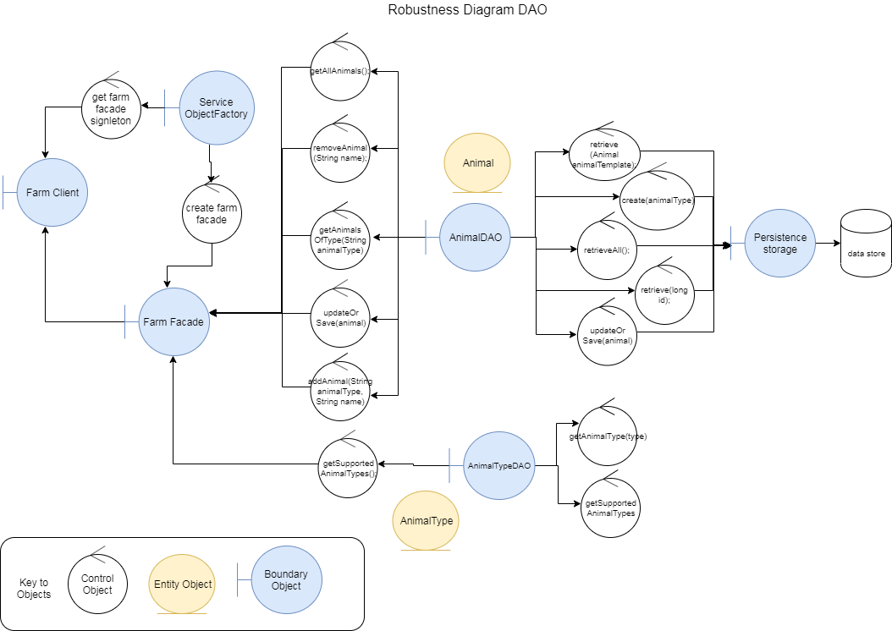

## More advanced Facade Pattern

A more advanced example is provided below which is implemented in the factoryandfacade3 project

DTO classes are at the bottom of the diagram. 
These are simple java beans which are used to pass information between layers.

DAO classes are in the middle of the diagram.
These are used to create animal types and animals which are saved using the Animal dao

The FarmFacade provides a simpler interface which used both the DAO's in order to support ReST and JSP pages.

## Use Cases and Robustness Diagrams

We can use draw.io https://www.draw.io/ to draw other UML diagrams such as Use Cases, Robustness diagrams and Sequence diagrams. 

The draw.io xml files and their related .png images are in the drawio folder. 

These are also referenced below;

### Farm Robustness Diagram

