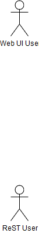

# UML Models

## class diagrams

### A simple UML model of the project 

DTO classes are at the bottom of the diagram. 
These are simple java beans which are used to pass information between layers.

Service in the middle of the diagram.
These are used to items to put in the shopping cart

### Full UML model showing implementation and factory classes
This diagram shows the implementation and factory classes and the supporting classes provided by the web container.
Usually a model doesn't need to go into this detail if we know the supporting classes exist.

### UML model with additional Invoice class

### UML model including DAOs

## Use Cases and Robustness Diagrams

We can use draw.io https://www.draw.io/ to draw other UML diagrams such as Use Cases, Robustness diagrams and Sequence diagrams. 

The draw.io ,drawio files and their related .png images are in the drawio folder. 

These are also referenced below;

### Use Case Diagram

For a tutorial on use case diagrams see
https://drawio-app.com/uml-use-case-diagrams-with-draw-io/

Although not using drawio - this is also a good tutorial
https://www.lucidchart.com/pages/uml-use-case-diagram

For a fuller description of use cases see  [Schaum's outline of UML
Bennett, Simon.2nd ed.; c2005 in Solent library](https://catalogue.solent.ac.uk/permalink/44SSU_INST/bslj9g/alma990096667340204796) 

#### Template

#### Answer (simple case)

This example shows a version of the simple usecase for a shopping cart implemented in class

#### Answer (full case)

This example shows a version of a completed usecase for a shopping cart

### Robustness Diagram

Robustness diagrams are an optional 'stereotype' applied to standard UML and not covered in all texts.
They are used as part of the ICONIX process.  

See [A practical Tutorial on Robustness Analysis] (https://www.visual-paradigm.com/guide/uml-unified-modeling-language/robustness-analysis-tutorial/)

#### Template

#### Answer (simple use case)

This gives an answer to the simple use case which has been implemented in class.

### Sequence Diagram Answer (simple use case)

Sequence diagrams act as a more standard UML alternative to Robustness Diagrams.
This diagam shows two simple usecases

