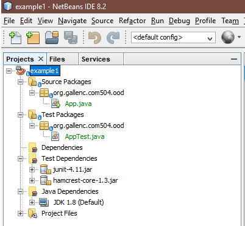

# Maven Test Exercise
This is an exercise to help teach you what you need to know about maven
Maven is a very powerfull tool to help you manage library dependencies, build and test your project.
It simplifies greatly the problem of building, testing and packaging projects and placing library jars on java class paths.
All of the major IDE's such as Eclipse, Netbeans and Intellij support maven.
This means that  
Maven allows you to create projects which are completely independent of the IDE you choose to use.
Nearly all modern open source java projects use Maven (or Gradel which also uses maven artefacts) as their build system. 

I am assuming you have copied week1 into myPracticeCourseWork and you are running these commands in your 'myPracticeCourseWork\week1\mavenTestExercises' folder

# Choosing and using a maven archetype
Maven has a vast number of contributed architype projects which provide templates to help you get started using a variety of java technologies. We will use an archetype to create our first maven project. 

(You can find more information about this process here
https://maven.apache.org/archetype/maven-archetype-plugin/usage.html)

1. open a command prompt and ensure maven is on your class path
```
mvn -version
```

2. cd into to your new myPracticeCourseWork\week1\mavenTestExercises folder

3. use the following command

```
mvn org.apache.maven.plugins:maven-archetype-plugin:3.2.0:generate
```

SIDE NOTE: 
```
We could have just used 

mvn archetype:generate

But I have found that depending on the version of maven installed, 
this might generate a different list of possible projects.
So we are specifying exactly which version of plugin to 
run to remove the uncertainty using the command format

mvn groupID:artifactID:version:goal
```

When you run the command 
You will be presented with a very large list of possible archetypes.

Choose the default (1674) 1674: remote -> org.apache.maven.archetypes:maven-archetype-quickstart (An archetype which contains a sample Maven project.)

When asked, enter the following values REPLACING gallenc with YOUR github username
```
Choose a number: 1674: 1674
Choose org.apache.maven.archetypes:maven-archetype-quickstart version:
1: 1.0-alpha-1
2: 1.0-alpha-2
3: 1.0-alpha-3
4: 1.0-alpha-4
5: 1.0
6: 1.1
7: 1.3
8: 1.4
Choose a number: 8: 8
Define value for property 'groupId': : org.gallenc.com504.ood  (REPLACE gallenc with your username)
Define value for property 'artifactId': : example1  (call this example1)
Define value for property 'version':  1.0-SNAPSHOT: :   (leave as 1.0-SNAPSHOT)
Define value for property 'package':  org.gallenc.com504.ood: : (leave the suggested package)
Confirm properties configuration:
groupId: org.gallenc.com504.ood
artifactId: example1
version: 1.0-SNAPSHOT
package: org.gallenc.com504.ood
 Y: :
```

You should now have an example1 project generated in your myPracticeCourseWork\week1\mavenTestExercises\example1 folder.

4. Build your new project
```
cd example1
mvn clean install
```
there should be lots of output followed by 'BUILD SUCCESSFULL'
congratulations, you have built your first maven project

## Open the project in your netbeans IDE
Open Netbeans in windows

1. right click in Projects panel and select 'import project'

2. navigate to your myPracticeCourseWork folder and select example1


3. examine the project in netbeans



a) Look under the Files Tab

notice that it contains the following folders:
```
src/main 
src/test 
target
```
target contains the built artefacts and is deleted by mvn clean and re created by mvn install

IMPORTANT you MUST ensure that /target/ is included in your .gitignore file so that it is NEVER checked into your git repository with the src files.

b) Look under the Projects tab

Notice the generated packages

c) Look at both App.java and AppTest.java

d) Look at the test dependencies

e) Right click on AppTest.java, select Run Test file, what happens?

f) Right click on App.java, select Run, what happens?

# look at the pom.xml file

open the example1 pom.xml file and notice the junit dependencies 

maven stores all the dependencies it downloads in a file called .m2

look in your C:\Users\ {your username} \ .m2 \repository folder and see if you can find the junit dependency

this has been downloaded automatically by maven from the central maven repository

see https://mvnrepository.com/artifact/junit/junit/4.11

# Exercise

a) can you move MyTestClassLog4j.java into your example1 project replacing App.java in the same location on the class path?

b) can you change the pom so that the 2 required log4j2 files are now downloaded and included in the build?

c) can you write a test class MyTestClassLog4jTest.java which runs the writeAboutMe() method?

# Finally
You have created a new project in  
```
myPracticeCourseWork\week1\mavenTestExercises
```
You should check this in to your local git repository and push to your github account.

IMPORTANT NOTE - make sure that the generated target directory is ignored by git (.gitignore). 
(You can also do this in Netbeans by right clicking the file/folder you wish to ignore and selecting git/ignore)

```
git status ( should show 'unstaged' commits)
git add --all (to 'stage' all the changes or new files you are going to commit'
git status (just to check what you are checking in)
git commit -m 'checking in my first example1' ( add a meaningful message so that people can see the history of your work)
git status ( whould show your repository is ahead of origin by one commit)
git push
```


