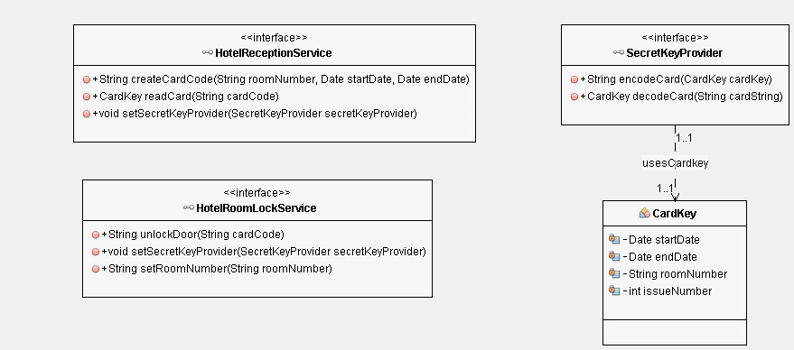

# Draw IO

We will be constructing our use cases using Draw IO

Draw IO (https://www.draw.io/) is a simple on line javascript based drawing library which can construct UML diagrams in your browser. 
Images can be saved and loaded as xml files within your project and exported as images which can be included in your documentation.

# key card Creation and validation use case diagram

# Card Creation and validation Robustness Diagram 

# Card Creation and validation Class Diagram

